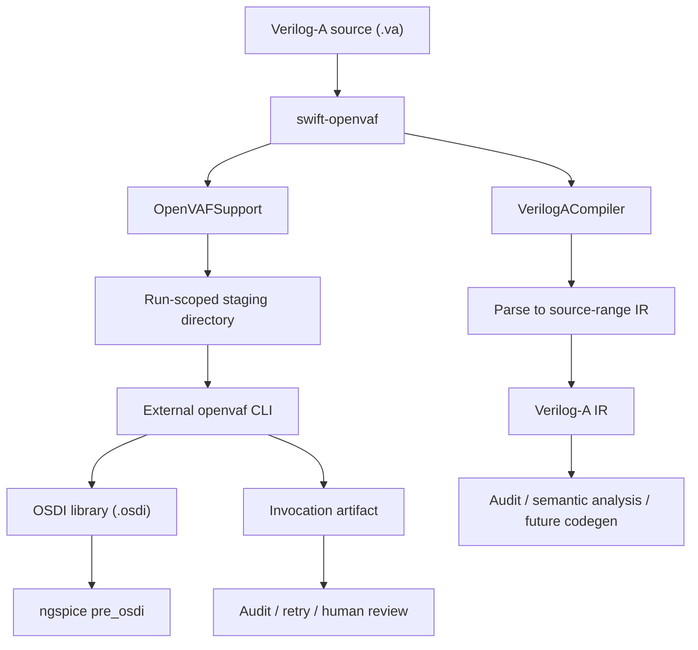
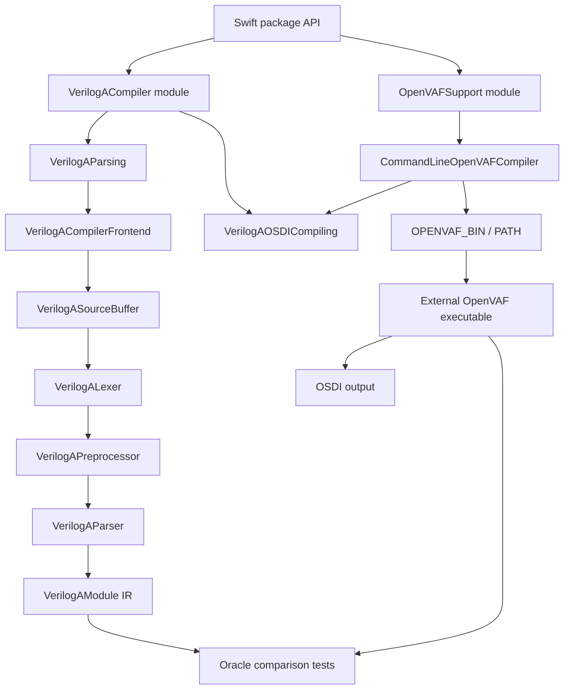
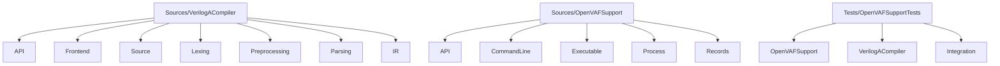
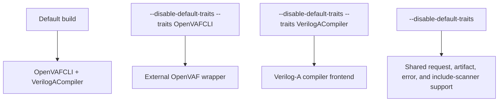
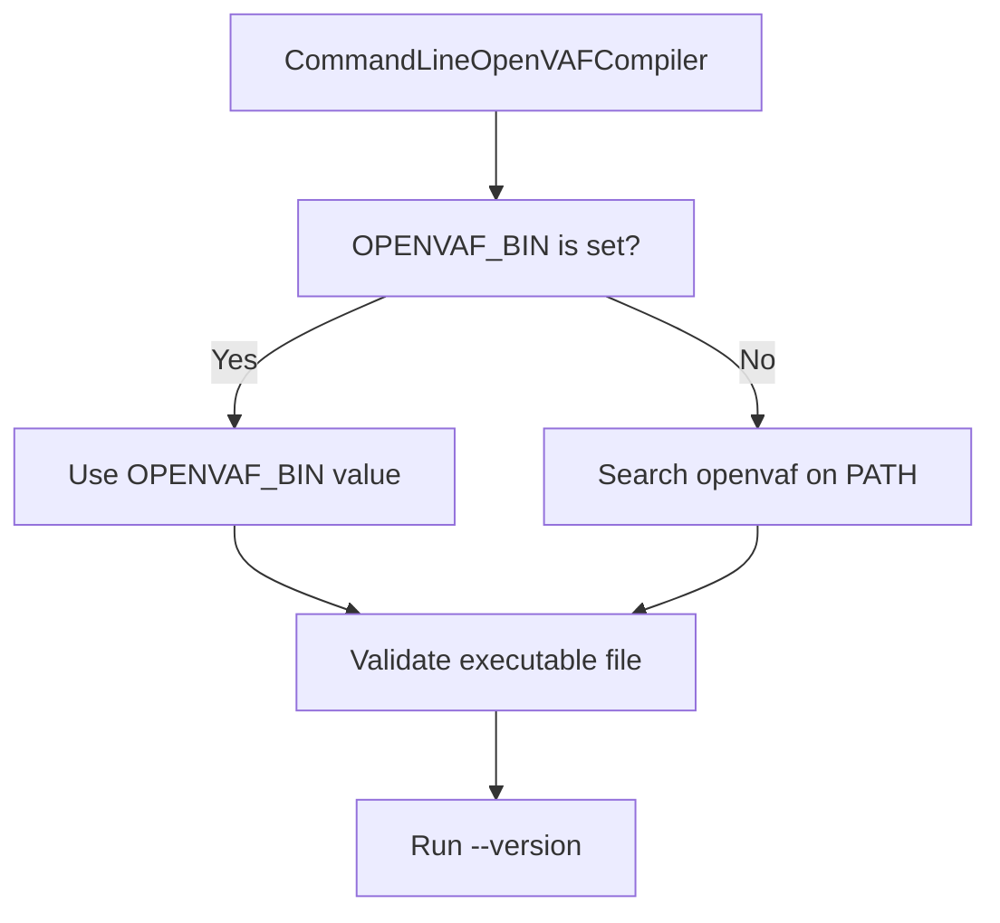
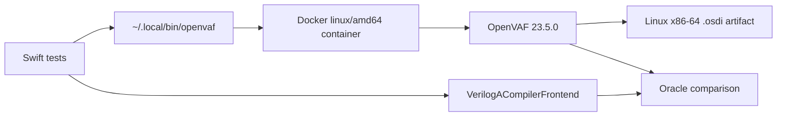
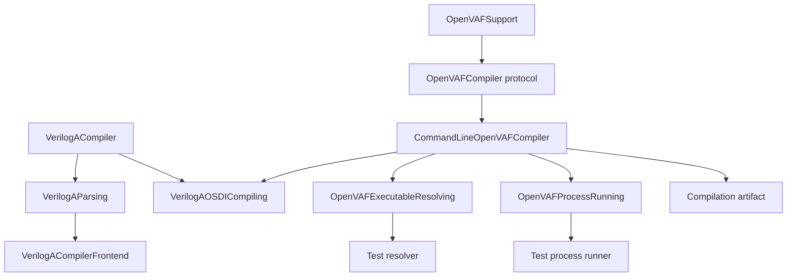

# swift-openvaf

[](https://github.com/1amageek/swift-openvaf/actions/workflows/ci.yml)

`swift-openvaf` is a Swift 6.3 package for working with Verilog-A compiler workflows from Swift. It provides a protocol-first `VerilogACompiler` module for in-process parsing and compiler capabilities, plus an `OpenVAFSupport` module that invokes an external OpenVAF command line compiler to produce OSDI libraries with reproducible invocation artifacts.



## Goals

| Goal | Behavior |
|---|---|
| Protocol-first compiler API | Exposes small compiler capability protocols through `VerilogACompiler` |
| Swift-first OpenVAF wrapper | Exposes trait-gated request types, artifacts, and typed errors through `OpenVAFSupport` |
| Reproducibility | Records command arguments, working directory, staged input file hashes, OpenVAF version, environment metadata, stdout, stderr, and timing |
| Local-first operation | Uses a configured executable, `OPENVAF_BIN`, or `openvaf` on `PATH` |
| Failure inspection | Compile-specific failures carry `OpenVAFCompilationFailure` metadata |
| Testability | Parser, resolver, and process runner dependencies are separated behind protocols |
| License clarity | Uses OpenVAF as an external executable and oracle, not as linked or copied GPL implementation code |

## Modules and Implementation Tracks

The package separates the Verilog-A compiler interfaces from the OpenVAF command-line wrapper.



| Module | Owns | Purpose |
|---|---|---|
| `VerilogACompiler` | `VerilogAParsing`, `VerilogAOSDICompiling`, source buffers, lexer, preprocessor, parser, source-range IR, include scanner | Protocol-first Verilog-A compiler surface and in-process frontend |
| `OpenVAFSupport` | `CommandLineOpenVAFCompiler`, process execution, executable resolution, OpenVAF artifacts and failures | External OpenVAF wrapper that conforms to `VerilogAOSDICompiling` |
| Oracle comparison | Mandatory hosted CI and optional local tests | Uses pinned external OpenVAF as a black-box oracle in hosted CI; local runs remain conditional on tool availability |

The package implementation is developed independently from OpenVAF's GPL source. OpenVAF is used as an external executable and black-box oracle, not as linked or copied implementation code.

## Source Layout

Source directories mirror compiler responsibilities so module boundaries stay easy to audit.



| Directory | Responsibility |
|---|---|
| `Sources/VerilogACompiler/API` | Public compiler protocols and implementation selection |
| `Sources/VerilogACompiler/Frontend` | In-process compiler frontend entry point |
| `Sources/VerilogACompiler/Source` | Source buffers, ranges, diagnostics, and source loading errors |
| `Sources/VerilogACompiler/Lexing` | Lexer, tokens, symbols, and keywords |
| `Sources/VerilogACompiler/Preprocessing` | Preprocessor filtering and include scanning |
| `Sources/VerilogACompiler/Parsing` | Parser and declarator-name extraction |
| `Sources/VerilogACompiler/IR` | Source-range-preserving Verilog-A IR |
| `Sources/OpenVAFSupport/API` | Public OpenVAF requests, Foundation-backed results, availability, configuration, and errors |
| `Sources/OpenVAFSupport/CommandLine` | External OpenVAF command-line compiler implementation and protocol conformance |
| `Sources/OpenVAFSupport/Executable` | Executable validation, resolution, and version cache |
| `Sources/OpenVAFSupport/Process` | Process command execution, output capture, cancellation, and timeout handling |
| `Tests/OpenVAFSupportTests/OpenVAFSupport` | OpenVAF wrapper unit tests |
| `Tests/OpenVAFSupportTests/VerilogACompiler` | In-process compiler frontend and include scanner tests |
| `Tests/OpenVAFSupportTests/Integration` | E2E, OpenVAF oracle, and upstream parity tests |

## Build Traits

`Package.swift` uses the sibling `../CircuiteFoundation` checkout when its
manifest exists. An independent checkout falls back to the pinned
`CircuiteFoundation` GitHub revision
`7abcac83517935c9b9f7553d7016d62cffde259d`.

SwiftPM traits choose which implementation track is compiled.



| Trait selection | Public implementation surface |
|---|---|
| Default | `VerilogACompilerFrontend`, `VerilogAParsing`, `VerilogAOSDICompiling`, and `CommandLineOpenVAFCompiler` |
| `OpenVAFCLI` | External OpenVAF process wrapper and `VerilogAOSDICompiling` conformance |
| `VerilogACompiler` | In-process Verilog-A parser frontend and source-range IR |
| No traits | Shared protocols, request/artifact/error types, and internal include scanning support |

```bash
swift build
swift build --disable-default-traits --traits OpenVAFCLI
swift build --disable-default-traits --traits VerilogACompiler
swift build --disable-default-traits
```

## Requirements

| Requirement | Value |
|---|---|
| Swift tools version | Swift 6.3 |
| Swift language mode | Swift 6 |
| Platform | macOS 15 or later |
| External tool | Required only when the `OpenVAFCLI` trait is used for real compilation |
| License | OpenVAFSupport Attribution License 1.0 |

OpenVAF's official installation documentation currently lists pre-compiled executables for Windows and Linux and states that macOS is not supported. On macOS, `OpenVAFSupport` can still wrap a caller-supplied compatible or custom-built OpenVAF executable, but real end-to-end compilation is only available when such an executable is present.

## Installation

Add `swift-openvaf` as a SwiftPM dependency.

The current module split is available from `0.8.0`.

```swift
.package(
    url: "https://github.com/1amageek/swift-openvaf.git",
    from: "0.8.0"
)
```

Then add the product you need to your target.

| Product | Use when |
|---|---|
| `VerilogACompiler` | You need in-process Verilog-A parsing, compiler protocols, source buffers, and source-range IR |
| `OpenVAFSupport` | You need to invoke an external OpenVAF executable and collect OSDI artifacts |

```swift
.product(name: "VerilogACompiler", package: "swift-openvaf"),
.product(name: "OpenVAFSupport", package: "swift-openvaf")
```

For local development, use a path dependency.

```swift
.package(path: "../swift-openvaf")
```

The latest released tag is `0.8.0`. Use version-based dependencies for released APIs, and use the `main` branch only when you need unreleased changes.

```swift
.package(
    url: "https://github.com/1amageek/swift-openvaf.git",
    from: "0.8.0"
)
```

## Quick Start

Use `VerilogACompiler` for in-process parsing without launching OpenVAF.

```swift
import VerilogACompiler

let source = VerilogASourceBuffer(string: verilogASource)
let parser: any VerilogAParsing = VerilogACompilerFrontend()
let result = parser.parse(source)

for module in result.modules {
    print(module.name(in: result.source))
}
```

Use `OpenVAFSupport` when an external OpenVAF executable should produce an OSDI artifact.

```swift
import Foundation
import OpenVAFSupport

let compiler = CommandLineOpenVAFCompiler()
let artifact = try await compiler.compile(
    sourceAt: URL(fileURLWithPath: "/path/to/model.va"),
    to: URL(fileURLWithPath: "/path/to/build/openvaf")
)

if let output = artifact.outputArtifact {
    print(try output.locator.location.resolvedFileURL().path)
}
```

Use `VerilogAOSDICompiling` when code should depend on an OSDI compiler capability instead of a concrete OpenVAF wrapper.

```swift
import OpenVAFSupport
import VerilogACompiler

let compiler: any VerilogAOSDICompiling<OpenVAFCompilationResult> = CommandLineOpenVAFCompiler()
let artifact = try await compiler.compileOSDI(
    sourceAt: URL(fileURLWithPath: "/path/to/model.va"),
    to: URL(fileURLWithPath: "/path/to/build/openvaf")
)
```

## Executable Discovery

The default configuration resolves OpenVAF in this order:



Set `OPENVAF_BIN` when `openvaf` is not available on `PATH`.
When `PATH` is missing or empty, discovery does not fall back to the current directory. Empty components inside an explicitly provided `PATH` still represent the current directory.

```bash
export OPENVAF_BIN=/path/to/openvaf
```

You can also configure discovery explicitly.

```swift
let compiler = CommandLineOpenVAFCompiler(configuration: OpenVAFConfiguration(
    executable: .path("/path/to/openvaf")
))
```

Use `.name("openvaf")` only for plain executable file names that should be searched on `PATH`. Use `.path(...)` for non-empty absolute or relative paths. Empty `PATH` components are treated as current-directory searches, matching POSIX command lookup behavior.

## OpenVAF Compilation

This API is available when the `OpenVAFCLI` trait is enabled.

```swift
import Foundation
import OpenVAFSupport

let compiler = CommandLineOpenVAFCompiler()

let availability = await compiler.availability()
guard availability.isAvailable else {
    throw OpenVAFError.executableNotFound(name: "openvaf", searchedPaths: [])
}

let artifact = try await compiler.compile(
    sourceAt: URL(fileURLWithPath: "/path/to/model.va"),
    to: URL(fileURLWithPath: "/path/to/build/openvaf")
)

for reference in artifact.artifacts {
    print("\(reference.locator.role.rawValue): \(reference.digest.hexadecimalValue)")
}
```

## Custom Output Name

OpenVAF generates `<source-basename>.osdi` beside the source file. `OpenVAFSupport` does not assume an unsupported output flag. Instead, it stages the source with a matching basename so the generated OSDI file has the requested name.

```swift
let artifact = try await compiler.compile(OpenVAFCompilationRequest(
    sourceURL: URL(fileURLWithPath: "/path/to/original.va"),
    outputDirectory: URL(fileURLWithPath: "/path/to/build/openvaf"),
    outputFileName: "model-debug.osdi"
))

if let output = artifact.outputArtifact {
    print(try output.locator.location.resolvedFileURL().lastPathComponent)
}
```

Output file names must be plain `.osdi` file names. Empty names, NUL bytes, path components, and names that would make the staged source collide with a staged include are rejected.

When the source uses local quoted Verilog-A includes, `OpenVAFSupport` stages the referenced files with the same relative layout so the staged source can still resolve them. By default, only files inside the source file's directory are staged. Set `includeRootDirectory` when a project uses parent-relative local includes.

```swift
let artifact = try await compiler.compile(OpenVAFCompilationRequest(
    sourceURL: URL(fileURLWithPath: "/path/to/project/models/model.va"),
    outputDirectory: URL(fileURLWithPath: "/path/to/build/openvaf"),
    outputFileName: "model.osdi",
    includeRootDirectory: URL(fileURLWithPath: "/path/to/project")
))
```

Existing local include files outside `includeRootDirectory` are rejected before staging. Symlinks are resolved for the boundary check, then staged as regular files at their source-relative include path. Absolute quoted include paths are rejected because the staged source is not rewritten. Missing local include files are left to OpenVAF's own include resolution, which preserves support for built-in files such as `disciplines.vams`.

Compilation request URLs must be local `file://` URLs with no host, or with `localhost` as the host. `sourceURL`, `outputDirectory`, and `includeRootDirectory` are validated before executable resolution so remote URL schemes, non-local file URL hosts, and empty file URL paths are never interpreted as local filesystem paths. Request URL paths must not contain NUL. Percent-encoded parent markers are normalized without resolving symlink source names. When `outputDirectory` already exists, it must be a directory.

## Failure Handling

Compile-specific failures preserve invocation evidence through `OpenVAFCompilationFailure`.

```swift
do {
    _ = try await compiler.compile(
        sourceAt: URL(fileURLWithPath: "/path/to/model.va"),
        to: URL(fileURLWithPath: "/path/to/build/openvaf")
    )
} catch let error as OpenVAFError {
    switch error {
    case .compilationFailed(let failure),
            .compilationCancelled(let failure),
            .compilationLaunchFailed(let failure),
            .outputMissing(let failure):
        print(failure.provenance.invocation?.arguments ?? [])
        print(failure.diagnostics)
    case .compilationTimedOut(let failure, let timeout):
        print(timeout)
        print(failure.logArtifacts)
    default:
        throw error
    }
}
```

## Artifacts

Successful compilations return `OpenVAFCompilationResult`; compile-specific
errors retain `OpenVAFCompilationFailure`. Both types conform directly to
`ArtifactProducing` and `DiagnosticReporting`.

| Foundation field | Meaning |
|---|---|
| `artifacts` with role `source-input` | Original primary and included Verilog-A locations with the digest and byte count captured from the stage-time snapshot; later source mutation is detectable as a verifier mismatch |
| `artifacts` with role `input` | Staged snapshots actually consumed by OpenVAF and recorded in provenance inputs |
| `artifacts` with role `output` | Produced OSDI model, when valid |
| `artifacts` with role `log-evidence` | Retained stdout and stderr text files |
| `provenance.invocation` | Executable, arguments, and working directory |
| `provenance.environment` | Platform, architecture, OpenVAF toolchain, and allowlisted environment digest |
| `diagnostics` | Structured completion or failure diagnostics |

The environment fingerprint hashes only the reproducibility allowlist. Raw
environment values, environment keys outside the allowlist, and secrets are
never retained in the result or provenance.

## Working Directories

Each compile creates a run-scoped directory under the requested output directory.

```text
<output-directory>/
  openvaf-<uuid>/
    <relative-source-directory>/
      <staged-source>.va
      <output>.osdi
      openvaf.stdout.log
      openvaf.stderr.log
    <relative-include-directory>/
      <local-include-file>
```

Successful and compile-specific failed executions keep this directory because
their Foundation artifact references must remain verifiable. Staging failures
that occur before an execution record can be created still follow the configured
cleanup policy.

## Configuration

| Property | Default | Purpose |
|---|---|---|
| `executable` | `.environment(variable: "OPENVAF_BIN", fallbackName: "openvaf")` | Selects how to find OpenVAF |
| `compileTimeout` | 300 seconds | Maximum compile duration |
| `availabilityTimeout` | 10 seconds | Maximum `--version` duration |
| `terminationGrace` | 2 seconds | Grace period before force-killing a terminated process |
| `postExitOutputDrainGrace` | 100 milliseconds | Maximum time to continue draining stdout/stderr after the direct process exits while inherited pipe writers remain open |
| `processEnvironment` | `nil` | Uses inherited process environment when `nil` |
| `compilerArguments` | `[]` | Extra arguments passed before the staged source name |
| `keepsFailedWorkingDirectories` | `false` | Preserves failed staging directories when enabled |

`compileTimeout` and `availabilityTimeout` must be greater than zero. `terminationGrace` and `postExitOutputDrainGrace` must not be negative. Executable paths must not be empty. Explicit environment keys and compiler arguments must be representable at the POSIX process boundary. Invalid configuration is reported as a typed error before staging or launching a process.

`OpenVAFCompilationRequest.includeRootDirectory` controls which existing local include files may be staged. When omitted, it defaults to the source file's directory.

## Verilog-A Compiler Details

This API is available from the `VerilogACompiler` module when the `VerilogACompiler` trait is enabled. `VerilogAParsing` defines the parser boundary, and `VerilogACompilerFrontend` provides the package in-process implementation.

```swift
import VerilogACompiler

let source = VerilogASourceBuffer(string: verilogASource)
let parser: any VerilogAParsing = VerilogACompilerFrontend()
let result = parser.parse(source)

for module in result.modules {
    print(module.name(in: result.source))
}
```

The external OpenVAF wrapper is exposed as an OSDI compiler capability through `VerilogAOSDICompiling`.

```swift
import OpenVAFSupport
import VerilogACompiler

let compiler: any VerilogAOSDICompiling<OpenVAFCompilationResult> = CommandLineOpenVAFCompiler()
let artifact = try await compiler.compileOSDI(sourceAt: sourceURL, to: outputDirectory)
```

The frontend stores source text once in `VerilogASourceBuffer`. Tokens and parsed IR carry `VerilogASourceRange` byte ranges into that buffer, so downstream semantic analysis and code generation can defer string materialization. Use `validatedString(in:)` or `validate(_:)` when a caller needs invalid source ranges to fail explicitly instead of using the clamping behavior of `string(in:)`.

`parse(contentsOf:)` accepts local `file://` URLs only. Non-file schemes, non-local file URL hosts, empty paths, and paths containing NUL are rejected before source bytes are read.

Current compiler frontend coverage:

| Component | Current capability |
|---|---|
| `VerilogALexer` | Identifiers, escaped identifiers, keywords, numbers, strings, comments, symbols, UTF-8 byte order mark handling, diagnostics |
| `VerilogAPreprocessor` | Known line-start directive filtering with comments treated as whitespace, `include` line filtering, continued directive body filtering, object-like `define` / `undef` tracking, `ifdef` / `ifndef` / `elsif` / `else` / `endif` conditional token selection, and preservation of non-directive macro invocations with original source ranges |
| `VerilogAParser` | Module headers, ANSI inline port declarations, declaration and parameter attributes, ports, declarations, multi-declarator and dimensioned parameters, brace-delimited parameter defaults, parameter constraint clauses, analog functions, nested analog block ranges, compound analog statement ranges, analog initial blocks, analog case ranges, opaque function-like line-start macro invocation recovery with bounded recovery for unterminated calls, object-like macro prefix recovery that preserves following syntax, declarator recovery, and module-boundary recovery diagnostics |
| `VerilogADeclaratorNameExtractor` | Declarator name extraction across inline qualifiers, ranges, brace-delimited defaults, and branch-style parenthesized endpoints |
| `VerilogAModule` | Source-range IR for module name, ports, inline and body declarations, parameters, analog functions, and analog blocks |
| Oracle tests | Conditional comparison across independently authored fixtures and OpenVAF upstream frontend fixtures accepted by external OpenVAF |

## Error Model

| Error | When it occurs |
|---|---|
| `invalidConfiguration` | A timeout, termination grace, executable setting, explicit environment, or compiler argument is invalid |
| `executableNotFound` | No configured executable can be found |
| `invalidExecutableName` | An executable name contains path components or is not a plain file name |
| `notExecutable` | The resolved file is not executable |
| `invalidOutputFileName` | `outputFileName` is empty, contains NUL, contains path components, is not `.osdi`, or would collide with a staged include |
| `invalidSourceURL` | The Verilog-A compiler frontend source URL is not a local file URL or has an invalid file path |
| `VerilogASourceRangeError.invalidRange` | A caller asks `VerilogASourceBuffer` to validate a source range outside the buffer |
| `fileSystemFailure` | Source validation, staging, hashing, or directory creation fails |
| `launchFailed` | The process cannot be launched |
| `timedOut` / `cancelled` | Availability checks time out or are cancelled |
| `compilationTimedOut` | Compile process times out and includes failure evidence |
| `compilationCancelled` | Compile process is cancelled and includes failure evidence |
| `compilationFailed` | OpenVAF exits with a non-zero code |
| `outputMissing` | OpenVAF exits successfully but the expected OSDI file is missing, empty, a directory, or a symlink |

## Testing

Run the package tests.

```bash
scripts/swift-test-timeout.sh 30 swift test
```

Trait-specific test runs are useful when validating package consumers that only want one implementation track.

```bash
scripts/swift-test-timeout.sh 60 swift test --disable-default-traits --traits OpenVAFCLI
scripts/swift-test-timeout.sh 60 swift test --disable-default-traits --traits VerilogACompiler
scripts/swift-test-timeout.sh 60 swift test --disable-default-traits
```

The test suite covers:

| Area | Coverage |
|---|---|
| Resolver | Environment precedence, `PATH` lookup, executable regular file validation, non-executable rejection |
| Compiler | Availability, regular source staging, local include staging with inactive conditional include filtering, staged input file fingerprints, streamed source hashing, custom output names, version caching, cleanup policy |
| Integration | Fake `openvaf` executable through real `PATH` resolution, process execution, staging, and artifact validation |
| Failure artifacts | Non-zero exit, timeout, cancellation, missing or invalid output |
| Process runner | stdout/stderr capture, stdin EOF isolation, large output drain, inherited pipe handles, configurable post-exit output draining, invalid UTF-8, launch failure, timeout, cancellation |
| Verilog-A compiler frontend | Lexer diagnostics, UTF-8 byte order mark handling, source ranges, source range validation, escaped identifiers, numeric forms, preprocessor conditionals with comment-prefixed directives, continued preprocessor directive bodies, function-like line-start macro invocation recovery including comment-prefixed, multiline, and unterminated invocations, object-like macro prefixes followed by real syntax, ANSI inline port declaration IR, declaration and parameter attributes, unterminated attribute diagnostics, declarator and module-boundary recovery diagnostics, qualifier-style declarators, variables, branches, multi-declarator and dimensioned parameters, brace-delimited parameter defaults, parameter constraint clauses, analog functions, nested analog blocks, compound analog statements, analog initial blocks, analog case ranges, multi-module parsing |
| Oracle comparison | Compiler frontend parse results compared against multiple independently authored sources that OpenVAF compiles successfully |
| Upstream parity | Verilog-A compiler frontend values compared with OpenVAF `openvaf/test_data` frontend fixtures when `OPENVAF_UPSTREAM_ROOT` points at an OpenVAF checkout |
| End-to-end | Real OpenVAF Verilog-A to OSDI compile when a compatible OpenVAF executable is available |
| Trait selection | `OpenVAFCLI`, `VerilogACompiler`, default, and no-trait build/test coverage |

Swift Testing suites use explicit `timeLimit` traits to guard against hangs.

The compiler frontend fixtures are independently authored. Upstream OpenVAF tests are used as a coverage map, not vendored as test sources.

OpenVAF upstream parity tests are gated by `OPENVAF_UPSTREAM_ROOT`. They read a local OpenVAF checkout and compare extracted values for module names, ports, declarations, parameters, selected parameter default values, analog functions, and analog block counts. When `OPENVAF_BIN` or `openvaf` is also available, the compileable upstream subset is compiled by OpenVAF in the same test.

```bash
OPENVAF_UPSTREAM_ROOT=/path/to/OpenVAF \
  scripts/swift-test-timeout.sh 120 swift test --filter OpenVAFUpstreamFrontendParityTests
```

End-to-end tests are gated because OpenVAF is an external tool. They run automatically when `OPENVAF_BIN` or `openvaf` on `PATH` resolves to an executable. Set `OPENVAF_E2E=1` to make the E2E test mandatory; the test will fail if OpenVAF cannot be found.

```bash
OPENVAF_BIN=/path/to/openvaf OPENVAF_E2E=1 swift test --filter OpenVAFE2ETests
```

The hosted `Pinned OpenVAF oracle` job runs the production
`OpenVAFSupport` API through the `openvaf-qualification` executable on Linux;
missing tools, failed compilation, timeout-contract failures, and missing
upstream fixtures fail the command instead of becoming skipped tests. A
separate macOS job executes the pinned frontend parity suites through
`xcodebuild`. Together they verify the pinned OpenVAF archive and executable
SHA-256 values, real success and malformed-source compilations, process timeout
behavior, and same-source frontend/OpenVAF acceptance. They retain:

| Evidence | Retained content |
|---|---|
| Installation manifest | OpenVAF version, archive digest, executable digest, Docker image identity, and shim path |
| Successful execution | OSDI bytes, staged source, stdout/stderr, invocation, environment, and canonical result JSON |
| Failed execution | Malformed source, stdout/stderr, invocation, environment, diagnostics, and canonical failure JSON |
| Qualification report | Tool digest plus success, failure, timeout, and upstream result paths |
| Test result | Full `OpenVAFFrontendParity.xcresult` bundle |

### macOS OpenVAF Oracle

OpenVAF does not currently ship a macOS executable. For local oracle testing on macOS, this repository provides a setup script that installs the official Linux x86-64 OpenVAF 23.5.0 binary under `~/.local/share/openvaf`, builds a local Docker image with the required Linux linker toolchain, and writes a `~/.local/bin/openvaf` shim.



```bash
scripts/install-openvaf-oracle.sh
openvaf --version
OPENVAF_E2E=1 scripts/swift-test-timeout.sh 60 swift test --filter OpenVAFE2ETests
scripts/swift-test-timeout.sh 60 swift test --filter VerilogACompilerFrontendOracleComparisonTests
```

The Docker shim is intended for parser/compiler oracle validation. The generated `.osdi` files are Linux x86-64 shared libraries and are not loadable on macOS.

## OpenVAF Binary Distribution

`OpenVAFSupport` does not bundle an OpenVAF executable.

| Reason | Impact |
|---|---|
| Platform availability | OpenVAF's published standalone executables target Linux and Windows; macOS is not currently supported by the upstream installation guide |
| Licensing | OpenVAF is GPL licensed, while this Swift wrapper uses an attribution-required license |
| Reproducibility | Callers should choose and record the exact OpenVAF executable used in their toolchain |

Provide OpenVAF through `OPENVAF_BIN`, `PATH`, or `OpenVAFConfiguration(executable:)`.

## License

`swift-openvaf` is distributed under the OpenVAFSupport Attribution License 1.0.

| Permission | Condition |
|---|---|
| Use | Permitted |
| Modification | Permitted |
| Redistribution | Permitted in source and binary forms |
| Sublicensing / sale | Permitted |
| Attribution notice | Required for third-party products, services, tools, libraries, source distributions, binary distributions, and hosted workflows that use the package |
| Endorsement | The copyright holder name cannot be used to promote derived products without written permission |

This is intentionally not MIT licensed. When `swift-openvaf` is used in something made available to third parties, the attribution notice must be visible to users or recipients through an about screen, credits screen, licenses screen, documentation, package metadata, command line `--version` or `--license` output, generated license bundle, or another reasonably accessible location. The notice must include the name `OpenVAFSupport`, as required by the license text. Private internal use does not require publishing an attribution notice.

## Design Notes

`swift-openvaf` keeps compiler capabilities and external process orchestration separate. `VerilogACompiler` owns in-process compiler interfaces and source-range IR, while `OpenVAFSupport` wraps OpenVAF as an external process instead of embedding GPL compiler internals.



The package is intended for larger EDA workflows where parsed source structure, generated OSDI libraries, process logs, and invocation metadata must be auditable and reproducible.
