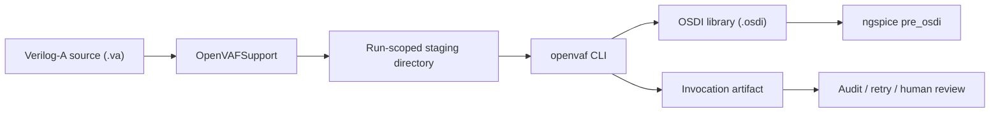
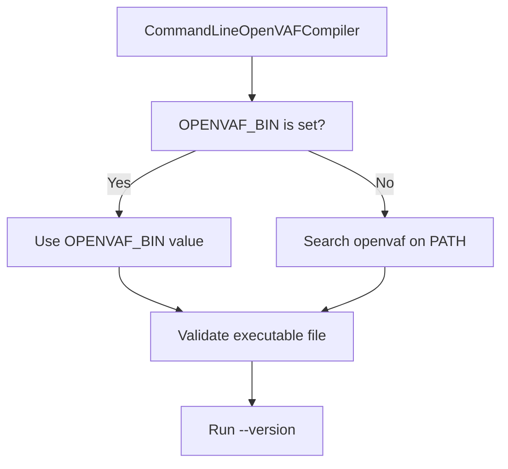
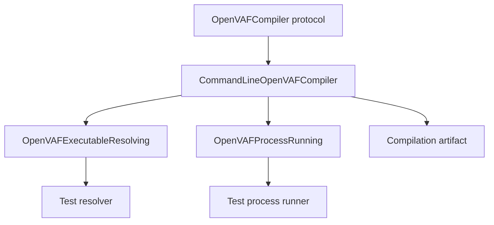

# OpenVAFSupport

`OpenVAFSupport` is a Swift 6.3 package for invoking the OpenVAF command line compiler from Swift code. It compiles Verilog-A sources into OSDI libraries and returns reproducible invocation artifacts that can be inspected by applications, command line tools, and agent workflows.



## Goals

| Goal | Behavior |
|---|---|
| Swift-first API | Exposes `OpenVAFCompiler`, `CommandLineOpenVAFCompiler`, `OpenVAFCompilationRequest`, and typed errors |
| Reproducibility | Records command arguments, working directory, source hash, OpenVAF version, environment metadata, stdout, stderr, and timing |
| Local-first operation | Uses a configured executable, `OPENVAF_BIN`, or `openvaf` on `PATH` |
| Failure inspection | Compile-specific failures carry `OpenVAFCompilationFailure` metadata |
| Testability | Resolver and process runner dependencies are injected behind protocols |

## Requirements

| Requirement | Value |
|---|---|
| Swift tools version | Swift 6.3 |
| Swift language mode | Swift 6 |
| Platform | macOS 15 or later |
| External tool | OpenVAF command line executable |
| License | BSD-3-Clause |

## Installation

Add `OpenVAFSupport` as a SwiftPM dependency.

```swift
.package(
    url: "https://github.com/1amageek/swift-openvaf.git",
    from: "0.2.0"
)
```

Then add the product to your target.

```swift
.product(name: "OpenVAFSupport", package: "swift-openvaf")
```

For local development, use a path dependency.

```swift
.package(path: "../swift-openvaf")
```

## Executable Discovery

The default configuration resolves OpenVAF in this order:



Set `OPENVAF_BIN` when `openvaf` is not available on `PATH`.

```bash
export OPENVAF_BIN=/path/to/openvaf
```

You can also configure discovery explicitly.

```swift
let compiler = CommandLineOpenVAFCompiler(configuration: OpenVAFConfiguration(
    executable: .path("/path/to/openvaf")
))
```

Use `.name("openvaf")` only for plain executable file names that should be searched on `PATH`. Use `.path(...)` for absolute or relative paths. Empty `PATH` components are treated as current-directory searches, matching POSIX command lookup behavior.

## Basic Usage

```swift
import Foundation
import OpenVAFSupport

let compiler = CommandLineOpenVAFCompiler()

let availability = await compiler.availability()
guard availability.isAvailable else {
    throw OpenVAFError.executableNotFound(name: "openvaf", searchedPaths: [])
}

let artifact = try await compiler.compile(
    sourceAt: URL(fileURLWithPath: "/path/to/model.va"),
    to: URL(fileURLWithPath: "/path/to/build/openvaf")
)

print(artifact.outputURL.path)
print(artifact.sourceSHA256)
```

## Custom Output Name

OpenVAF generates `<source-basename>.osdi` beside the source file. `OpenVAFSupport` does not assume an unsupported output flag. Instead, it stages the source with a matching basename so the generated OSDI file has the requested name.

```swift
let artifact = try await compiler.compile(OpenVAFCompilationRequest(
    sourceURL: URL(fileURLWithPath: "/path/to/original.va"),
    outputDirectory: URL(fileURLWithPath: "/path/to/build/openvaf"),
    outputFileName: "model-debug.osdi"
))

print(artifact.stagedSourceURL.lastPathComponent)
print(artifact.outputURL.lastPathComponent)
```

Output file names must be plain `.osdi` file names. Path components are rejected.

## Failure Handling

Compile-specific failures preserve invocation evidence through `OpenVAFCompilationFailure`.

```swift
do {
    _ = try await compiler.compile(
        sourceAt: URL(fileURLWithPath: "/path/to/model.va"),
        to: URL(fileURLWithPath: "/path/to/build/openvaf")
    )
} catch let error as OpenVAFError {
    switch error {
    case .compilationFailed(let failure),
            .compilationCancelled(let failure),
            .outputMissing(let failure):
        print(failure.command.arguments)
        print(failure.standardError)
    case .compilationTimedOut(let failure, let timeout):
        print(timeout)
        print(failure.standardOutput)
    default:
        throw error
    }
}
```

## Artifacts

Successful compilations return `OpenVAFCompilationArtifact`.

| Field | Meaning |
|---|---|
| `sourceURL` | Original source URL passed by the caller |
| `sourceSHA256` | SHA-256 hash of the staged source |
| `stagedSourceURL` | Source file copied into the run-scoped working directory |
| `outputURL` | Expected OSDI output URL |
| `command` | Sanitized command metadata |
| `openVAFVersion` | Version parsed from `openvaf --version`, when available |
| `exitCode` | OpenVAF process exit code |
| `standardOutput` | Captured stdout |
| `standardError` | Captured stderr |
| `startedAt` / `finishedAt` | Process timing |

`OpenVAFCommandRecord` stores redacted environment metadata. Environment values are not persisted directly; `OpenVAFEnvironmentRecord.valueSHA256` records a fingerprint for reproducibility checks.

## Working Directories

Each compile creates a run-scoped directory under the requested output directory.

```text
<output-directory>/
  openvaf-<uuid>/
    <staged-source>.va
    <output>.osdi
```

Successful compilations keep this directory because the returned artifact points to files inside it. Failed compilations remove it by default.

Use `keepsFailedWorkingDirectories` when failed staged files must remain available for inspection.

```swift
let compiler = CommandLineOpenVAFCompiler(configuration: OpenVAFConfiguration(
    keepsFailedWorkingDirectories: true
))
```

## Configuration

| Property | Default | Purpose |
|---|---|---|
| `executable` | `.environment(variable: "OPENVAF_BIN", fallbackName: "openvaf")` | Selects how to find OpenVAF |
| `compileTimeout` | 300 seconds | Maximum compile duration |
| `availabilityTimeout` | 10 seconds | Maximum `--version` duration |
| `terminationGrace` | 2 seconds | Grace period before force-killing a terminated process |
| `processEnvironment` | `nil` | Uses inherited process environment when `nil` |
| `compilerArguments` | `[]` | Extra arguments passed before the staged source name |
| `keepsFailedWorkingDirectories` | `false` | Preserves failed staging directories when enabled |

`compileTimeout` and `availabilityTimeout` must be greater than zero. `terminationGrace` must not be negative. Explicit environment keys and compiler arguments must be representable at the POSIX process boundary. Invalid configuration is reported as a typed error before staging or launching a process.

## Error Model

| Error | When it occurs |
|---|---|
| `invalidConfiguration` | A timeout, termination grace, executable setting, explicit environment, or compiler argument is invalid |
| `executableNotFound` | No configured executable can be found |
| `invalidExecutableName` | An executable name contains path components or is not a plain file name |
| `notExecutable` | The resolved file is not executable |
| `invalidOutputFileName` | `outputFileName` is empty, contains path components, or is not `.osdi` |
| `fileSystemFailure` | Source validation, staging, hashing, or directory creation fails |
| `launchFailed` | The process cannot be launched |
| `timedOut` / `cancelled` | Availability checks time out or are cancelled |
| `compilationTimedOut` | Compile process times out and includes failure evidence |
| `compilationCancelled` | Compile process is cancelled and includes failure evidence |
| `compilationFailed` | OpenVAF exits with a non-zero code |
| `outputMissing` | OpenVAF exits successfully but the expected OSDI file is missing |

## Testing

Run the package tests.

```bash
scripts/swift-test-timeout.sh 30 swift test
```

The test suite covers:

| Area | Coverage |
|---|---|
| Resolver | Environment precedence, `PATH` lookup, executable regular file validation, non-executable rejection |
| Compiler | Availability, regular source staging, streamed source hashing, custom output names, version caching, cleanup policy |
| Failure artifacts | Non-zero exit, timeout, cancellation, missing or invalid output |
| Process runner | stdout/stderr capture, large output drain, inherited pipe handles, invalid UTF-8, launch failure, timeout, cancellation |
| End-to-end | Real OpenVAF Verilog-A to OSDI compile when OpenVAF is available |

Swift Testing suites use explicit `timeLimit` traits to guard against hangs.

End-to-end tests are gated because OpenVAF is an external tool. They run automatically when `OPENVAF_BIN` or `openvaf` on `PATH` resolves to an executable. Set `OPENVAF_E2E=1` to make the E2E test mandatory; the test will fail if OpenVAF cannot be found.

```bash
OPENVAF_BIN=/path/to/openvaf OPENVAF_E2E=1 swift test --filter OpenVAFE2ETests
```

## OpenVAF Binary Distribution

`OpenVAFSupport` does not bundle an OpenVAF executable.

| Reason | Impact |
|---|---|
| Platform availability | OpenVAF's published standalone executables target Linux and Windows; macOS is not currently supported by the upstream installation guide |
| Licensing | OpenVAF is GPL licensed, while this Swift wrapper is BSD-3-Clause |
| Reproducibility | Callers should choose and record the exact OpenVAF executable used in their toolchain |

Provide OpenVAF through `OPENVAF_BIN`, `PATH`, or `OpenVAFConfiguration(executable:)`.

## License

`OpenVAFSupport` is distributed under the BSD-3-Clause License.

| Permission | Condition |
|---|---|
| Use | Permitted |
| Modification | Permitted |
| Redistribution | Permitted in source and binary forms |
| Attribution notice | Required when redistributing source or binary forms |
| Endorsement | The copyright holder name cannot be used to promote derived products without written permission |

This is intentionally not MIT licensed. Redistributors must keep the copyright notice, license conditions, and disclaimer in source redistributions, and must reproduce them in documentation and/or other materials for binary redistributions.

## Design Notes

`OpenVAFSupport` intentionally wraps OpenVAF as an external process instead of embedding compiler internals. This keeps the Swift package small, testable, and suitable for local toolchain orchestration.



The package is intended for larger EDA workflows where generated OSDI libraries, process logs, and invocation metadata must be auditable and reproducible.
